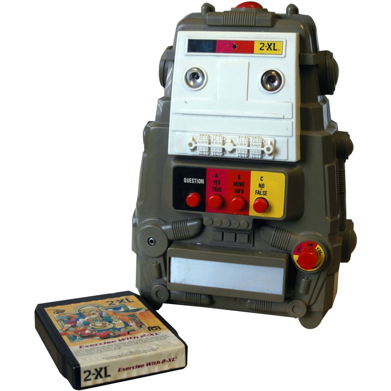

The Least Necessary to Know About Computers
###########################################

Introduction
************

The disagreement 
================

My 8 year old, Bash, and I have some disagreement on what a computer is. He tells me a computer doesn’t
have a touchscreen—those are for phones and tablets. He’s not too sure about his Nintendo Switch
video game console, but he doesn’t think so; it doesn’t have a keyboard and you can use its
touchscreen as well—definitely NOT a computer.

I tell him even my coffee machine is a computer. It is one if those fancy automatic espresso
makers—with a touchscreen. I tell him it executes specific instructions, repeating them each
time I ask it to make me a coffee, and it was programmed just like the computer on my desk. His
face is filled with doubt.

I ask him, ok, then what is a computer? He doesn’t seem quite as sure as when we started this
conversation, but he knows it doesn’t have a touchscreen. It seems I have just confused him, but
I’m still really confident I know the right answer—I just need some time to put it in the right words.

The motivation
==============

Why do I care so much he knows what my definition of a computer is anyway? Doesn’t he already know
computers impact almost every aspect of your daily life? From moving your money and moving
your car, to moving your emotions and moving your social status, the world is just short of
being moved entirely by computers. Does he realize this?—Sure he does. 

Venting to one of the other baseball dads about how our kids should be taught some basics
glossed over by our educational system, the dad agrees a course on common sense should be
mandatory—you know, like how to change a tire! Yeah, I say! Configuring a wireless router
and changing a tire.

It comes to me that we all have our own ideas about what qualifies as common sense. Figuring
out what is critical to know for people today isn't easy. Sitting in traffic, I imagine a
driver sitting on the side of the road, picking up their mobile phone and calling AAA, just
like my mother-in-law calls me when her printer isn't "showing up". Does she really need to
know how to reset her router to overcome an flooded DHCP table? I'm not sure, but at least
she knows what a tire is, why it might not be holding air and what it means for someone to
swap it out with a tire that will hold air. Perhaps being able to change the tire isn't the
goal, but I'd feel better about anyone driving a car if they knew what a tire was and why
it is important to the operation of that car.

AI. Bad code. boot times. 

The cloud is a place. 

All memory is both permanent and temporary, it is the level of effort to recover that changes. 

A computer is a data processing machine

Data is always volatile and non-volatile
“oh how easy we forget”

Its all sensors and actuators. We used to call these inputs and outputs. 

What is and is not a computer?
******************************

.. admonishion:: Bash's Definition

   *What is a computer?*

   A computer is a machine that can be programmed to translate words into 0s and can
   be made into different things, like a robot or a self-reading book. Anything can
   have a computer.

* Human computers
* Mechanical computers
* Embedded computers
* Analog computers and state machines

Computers do exactly what they are told

Computers process inputs and generate outputs

Computers remember everything, except what they forget, so make backups

* What is volatility?
* What 
* Memory is really another type if input and output
* Data recovery

There is no cloud, the network is not the computer

What makes a computer smart?

A computer is a machine
=======================

.. admonishion:: Bash's Definition

   *What is a machine?*

   A machine is a system that uses different power [sources], like coal, fire,
   contraptions, and chain reactions.

I feel like I should have started by asking about the definition of "work". 
From the viewpoint of a physicist, 

What is not a computer?
=======================

.. admonition:: Bash's Definition

   *Are there machines without computers?*

   Yes, there are machines without computers and they are called simple machines, for
   example, brooms, levers, wedges, wheels and axles, pulleys, and screws.

If a computer can be so many things, maybe we should start by describing what is not a computer.

Back in the 1980s, I met a really cool robot called 2XL. 2XL has a very engaging personality and an amazing sense of humor. And
2XL was smart, it knew history and science. It could make me laugh and it fed my interest in learning. I really like 2XL and
I miss it. 

2XL is not a computer.

But hey, wait, didn't I say robots were computers and 2XL is a robot? Yep, I said both of those things. I cannot honestly say
which one of them is wrong. Mind you, 2XL is not your typical robot. 2XL is basically a glorified 8-track player.

Does that mean an 8-track player is a robot?

For most of you that don't know, an 8-track player is like a cassette player, but where the tape is continuous and runs in a loop.
You can also move the head that reads the tape to 4 different positions, enabling you to hear one of four different stereo recordings
sitting side-by-side on the tape. Each recording, being stereo, meaning you have different audio for each of your two ears, takes up
two tracks, or lanes on the tape where the magnetic charge on the tape sits with different intensities representing the audio. Four
different 2-track recordings give the player its name, an 8-track player. And for those that don't know what a cassette player is,
well, it's a crummy version of an 8-track where you only have 4 tracks on the tape and you have to run the tape backwards when you
reach the end to hear the other stereo recording. And, naturally, most cassette tape players required you to manually eject the
cassette and flip it over, because the motors will only turn the tape one direction during playback and the head won't move to the
other track locations--it is just stuck in one place.

For some of you, your heads are spinning trying to grasp the mechanical complexity of a tape player. For others, this trip into
nostalgia probably also has you saying, "why didn't you just explain the simpler reel-to-reel mechanism?" OK. Moving on.

All of this is just to say that 2XL is an 8-track player with blinking lights for eyes that change with the volume of the audio
coming out of it. And 2XL had 4 red buttons on its belly, one for each of the possible recordings on the 8-track cassette you put
into it. This glorified tape player looked like a robot, spoke better than any robot I can imagine, responded to my inputs and
had electrical and mechanical innards that moved in response to both me and the recording. Definitely, 2XL is a robot in my book.
At least this book.

2XL likes to ask questions. Press a button and 2XL responds if you answered correctly. 2XL might even keep track if you've
made previous mistakes and get extra snarky.

2XL is ingeneous, however, 2XL is not a computer. Nothing in 2XL is executing the instructions of a computer program.

.. todo::

   Lot's left to elaborate here.

Why are computers important?
****************************

Why should computers be important to you?
*****************************************

Changing a computer's tire
**************************

How to configure and reset a router and modem

* DHCP

.. admonishion:: History

  * 

.. admonishion:: Exercises

  * Wireshark

