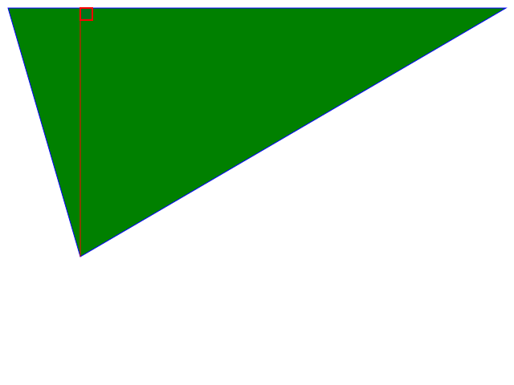

# 90 Degree Angles

This is a place to brainstorm about a project that involves the ability to create right triangles.

* What makes them magical and what magic can we create using them? 
* Does it make sense to use stepper motors to measure out a movement?

## Pen plotter project idea
I keep thinking about a wall-based pen-plotter-type-thing, but it doesn't feel magical enough to me yet.

